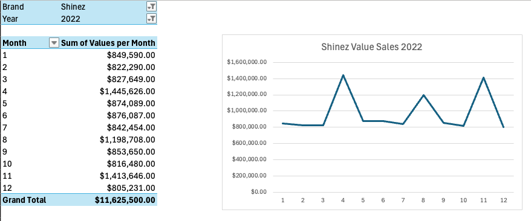

# Net Revenue Management for HealthMax: A Case Study 
Optimizing Net Revenue Management for a fictitious FMCG company using Excel, focusing on market analysis, product strategy, and sales forecasting. 

<!-- Improved compatibility of back to top link: See: https://github.com/othneildrew/Best-README-Template/pull/73 -->
<a name="readme-top"></a>

<!-- PROJECT SHIELDS -->
<!--
*** I'm using markdown "reference style" links for readability.
*** Reference links are enclosed in brackets [ ] instead of parentheses ( ).
*** See the bottom of this document for the declaration of the reference variables
*** for contributors-url, forks-url, etc. This is an optional, concise syntax you may use.
*** https://www.markdownguide.org/basic-syntax/#reference-style-links
-->
[![Contributors][contributors-shield]][contributors-url]
[![Forks][forks-shield]][forks-url]
[![Stargazers][stars-shield]][stars-url]
[![Issues][issues-shield]][issues-url]
[![MIT License][license-shield]][license-url]
[![LinkedIn][linkedin-shield]][linkedin-url]


<!-- PROJECT LOGO -->
<br />
<div align="center">
  <a href="https://github.com/ishamahadalkar/Net-Revenue-Management">
    
  </a>
  
<!-- Section Name tag -->
<a name="#about-the-project"></a>
<h3 align="center">Net Revenue Management in Excel</h3>

  <p align="center">
   This project is a case study on Net Revenue Management (NRM) within the Fast Moving Consumer Goods (FMCG) industry. I stepped into the role of a category manager for HealthMax, a shampoo supplier, and analyzed market data to identify growth opportunities using NRM strategies.
    <br />
  </p>
</div>


<!-- TABLE OF CONTENTS -->
<details>
  <summary>Table of Contents</summary>
  <ol>
    <li>
      <a href="#about-the-project">About The Project</a>
      <ul>
        <li><a href="#built-with">Built With</a></li>
      </ul>
    </li>
    <li>
      <a href="#getting-started">Getting Started</a>
      <ul>
        <li><a href="#prerequisites">Prerequisites</a></li>
        <li><a href="#installation">Installation</a></li>
      </ul>
    </li>
    <li>
      <a href="#executive-summary">Executive Summary</a>
      <ul>
        <li><a href="#project-scope">Project Scope</a></li>
      </ul>
    </li>
    <li>
      <a href="#problem-statement">Problem Statement</a>
      <ul>
        <li><a href="#kpis">Key Performance Indicators (KPIs)</a></li>
      </ul>
    </li>
    <li><a href="#data-sources">Data Sources</a>
      <ul>
          <li><a href="#preprocessing">Preprocessing</a></li>
      </ul>
    </li>
    <li><a href="#approach">Approach</a></li>
    <li><a href="#results">Results</a></li>
    <li><a href="#code-structure">Code Structure</a></li>
    <li><a href="#lessons-learned">Lessons Learned</a></li>
    <li><a href="#future-work">Future Work</a></li>
    <li><a href="#license">License</a></li>
    <li><a href="#contact">Contact</a></li>
    <li><a href="#acknowledgments">Acknowledgments</a></li>
  </ol>
</details>

<!-- Section Name tag -->
<a name="#built-with"></a>

### Built With

* [![Excel][excel-badge]][excel-url]


<p align="right">(<a href="#readme-top">back to top</a>)</p>


<!-- GETTING STARTED -->
## 🚀 Getting Started

To get started with the project, follow these steps:

<!-- Section Name tag -->
<a name="#getting-started"></a>

### Prerequisites

<!-- Section Name tag -->
<a name="#prerequisites"></a>

- Microsoft Excel: Ensure you have a version that supports advanced data analysis features.

### Installation

<!-- Section Name tag -->
<a name="#installation"></a>

1. Clone the repo
   ```sh
   git clone https://github.com/ishamahadalkar/Net-Revenue-Management
   ```

<p align="right">(<a href="#readme-top">back to top</a>)</p>

<!-- PROBLEM STATEMENT -->
## 📊 Executive Summary

<!-- Section Name tag -->
<a name="#executive-summary"></a>

This case study focused on applying analytical and business skills to a real-world problem within the FMCG industry. I analyzed data to identify growth opportunities related to Net Revenue Management for HealthMax, a shampoo supplier, and presented recommendations to management.

Key Deliverabes:
* 📈 Detailed market analysis and KPI calculations for HealthMax's product portfolio.
* 💼 Profitability matrix and strategic recommendations for product prioritization.
* 🔮 Forecasted net sales for 2023 and 2024, including the impact of NRM initiatives.
* 📊 Waterfall chart illustrating the effect of strategic initiatives on net sales.

Expected Outcomes:

* 🧠 Enhanced understanding of Net Revenue Management principles and their application.
* 🔍 Identification of high-potential products and market opportunities for HealthMax.
* 💡 Strategic insights into optimizing pricing, promotions, and product launches.
* 💰 Increased net sales and profitability through informed decision-making and NRM strategies.

<!-- PROJECT SCOPE -->
### 📚 Project Scope

<!-- Section Name tag -->
<a name="#project-scope"></a>

The project involves understanding the FMCG industry, analyzing the shampoo market, calculating KPIs, and applying NRM strategies to identify business opportunities and growth levers.

<p align="right">(<a href="#readme-top">back to top</a>)</p>

<!-- PROBLEM STATEMENT -->
## ❓Problem Statement

<!-- Section Name tag -->
<a name="#problem-statement"></a>

Problem Statement:
The primary challenge is to determine how HealthMax can leverage NRM principles to optimize pricing, enhance product placement, and drive promotional strategies to maximize net revenue.

### 📊 Key Performance Indicators (KPIs)

<!-- Section Name tag -->
<a name="#kpis"></a>

1. Market Share
* Measures HealthMax's sales relative to competitors, expressed as a percentage of total market sales. This KPI helps assess HealthMax's competitive position in the shampoo market.


<br>

2. Growth
* Evaluates the increase in sales over time to determine how HealthMax's brands are evolving. Calculated as the percentage change in sales from one period to the next.


<p align="right">(<a href="#readme-top">back to top</a>)</p>

<!-- DATA SOURCES -->
## 📂 Data Sources

<!-- Section Name tag -->
<a name="#data-sources"></a>

The dataset used in this project is external data provided by a major retailer, which includes sales data for various shampoo brands, including HealthMax and its competitors. The data is segmented by region, subcategory, and supplier, and is available in both unit and value sales from January 2018 to March 2023.


### 🛠️ Preprocessing

<!-- Section Name tag -->
<a name="#preprocessing"></a>

1. Data Cleaning

  * Stripped leading and trailing whitespace from column names to ensure consistency.
  * Checked for missing values across the dataset and removed rows where all elements were missing to maintain data integrity.

2. Missing Values

  * Identified and documented the number of missing values in each column to understand data gaps.

#### External Data


<p align="right">(<a href="#readme-top">back to top</a>)</p>


<!-- APPROACH -->
## 🧩 Approach

<!-- Section Name tag -->
<a name="#approach"></a>

### 🔍 Investigating the Dataset

1. Data Exploration
  - Created a pivot table to identify the number of different brands per supplier. This analysis revealed that HealthMax owns two brands in the market.

<br>


### 💼 Net Revenue Management

1. Net Sales Calculation
  - Imported the internal sales dataset to analyze HealthMax's product portfolio.
  - Calculated the net sales for each product in 2022, resulting in a total net sales figure of $20,480,715 for HealthMax products.

2. Gross Margin Analysis
  - Added a column for "Gross Profit per Unit" to determine the profitability of each product.
  - Created a "Gross Profit per Product" column to calculate the total gross profit generated by each product.
  - Introduced a "Gross Margin" column, calculating the gross margin for all products using the formula: Total Gross Profit per Product / Total Net Sales 2022.
  - Found that the average gross margin across HealthMax's portfolio is 68.49%.

#### Internal Sales Data


<br>

3. Profitability Matrix
  - Added a "Net Sales Contribution" column to determine each product's percentage contribution to the total net sales for 2022.
  - Created a PivotTable in a new worksheet called "Profitability Matrix" and visualized the data using a scatter plot.
  - The scatter plot revealed that Starbust Ultra Soft 100ML is the most important product with high contribution and margin, while the Strong Hair range showed lower profitability and net sales.

<br>

<br>

<br>

4. New Category Opportunity
  - Analyzed the brand mix and identified that HealthMax is active in only 2 out of 5 shampoo subcategories.
  - Determined that the fastest-growing subcategory from 2018 to 2022 is Organic Shampoo.
  - Estimated the full-year size of the Organic Shampoo subcategory for 2024, projecting a 20% increase over the March 2023 MAT values, resulting in an estimated sales volume of 1,020,899 units.

<br>

<br>

<br>

5. New Product Launch
  - Imported the New Product Launch dataset containing two potential organic shampoo products.
  - Estimated expected net sales, gross profit, and gross margin for both products.
  - Recommended launching Herbashine due to its higher gross profit potential, despite lower net sales compared to HerbEssentials.

#### New Product Launch Data


### 💹 Optimizing Net Revenue

1. Price Pack Architecture
  - Identified the potential for a smaller 50ml shampoo bottle, targeting travelers.
  - Calculated the retail price for the new 50ml Starbust Ultra Soft shampoo by applying a 50% markup on the price per ml of the 100ml pack.
  - Set the net price at $2.30 and cost of goods sold (COGS) at $0.70.
  - Estimated that the 50ml shampoo would achieve 10% of the 2022 volume of the 100ml pack, resulting in projected net sales of $265,960 annually.

#### 50ml shampoo bottle Data

<br>
<br>

2. Promotion Management
  - Analyzed the effectiveness of three different promotions for the Shinez brand in 2022.
  - Calculated the ROI for each promotion using baseline sales and uplift metrics.
  - Determined that Promotion #2 was the most effective, with a 12% ROI, while Promotion #1 had a negative ROI and should not be repeated.

#### Shinez Promotion Analysis

<br>
<br>

#### Promotion Analysis Data

<br>
<br>

3. Forecasting
  - Created a forecast for HealthMax's net sales in 2023 and 2024 without NRM initiatives, based on market trends until 2022.
  - Forecasted net sales for 2023 at $20,606,058 and for 2024 at $20,808,712.
<br>
<br>


<br>
<br>


4. Waterfall Chart
  - Developed a waterfall chart to illustrate the impact of NRM initiatives on 2024 net sales.
  - Included columns for estimated net sales 2023, natural growth, organic shampoo, 50ml shampoo, and estimated net sales 2024.
  - Demonstrated that NRM initiatives, including the launch of organic shampoo and 50ml shampoo, generated more net sales than natural growth alone.
<br>
<br>


<br>
<br>


<p align="right">(<a href="#readme-top">back to top</a>)</p>

<!-- RESULTS -->
## 🎯 Results

<!-- Section Name tag -->
<a name="#results"></a>

- Total Net Sales (2022): $20,480,715
- Average Gross Margin: 68.49%
- Fastest Growing Subcategory: Organic Shampoo
- Estimated 2024 Sales Volume for Organic Shampoo: 1,020,899 units
- Recommended Product Launch: Herbashine
- Estimated Net Sales for 50ml Shampoo: $265,960 annually
- Most Effective Promotion: Promotion #2 with a 12% ROI
- Forecasted Net Sales:
  * 2023: $20,606,058
  * 2024: $20,808,712
- Impact of NRM Initiatives: NRM strategies contributed significantly to the increase in net sales beyond natural growth.


<p align="right">(<a href="#readme-top">back to top</a>)</p>

<!-- CODE STRUCTURE -->
## 🗂️ Code Structure

<!-- Section Name tag -->
<a name="#code-structure"></a>

The codebase is organized into:

1. Datasets Folder: Contains the raw csv files for the external, internal and sales data used for the analysis.
2. Final Excel Workbook: Contains the NRM analysis. 


<p align="right">(<a href="#readme-top">back to top</a>)</p>


<!-- Lessons Learned -->
## 📚 Lessons Learned

<!-- Section Name tag -->
<a name="#lessons-learned"></a>

Throughout this case study, several key learnings were achieved:

1. Role of a Category Manager
  - Successfully assumed the role of a category manager, conducting a comprehensive market analysis in Excel.
  - Analyzed the entire shampoo category, uncovering valuable insights and identifying key market players.
  - Calculated essential KPIs such as growth and market share, and utilized more complex metrics like Year-To-Date (YTD) and Moving Annual Total (MAT) to enhance the analysis.

2. Understanding Net Revenue Management (NRM):
  - Gained a deep understanding of the importance and objectives of Net Revenue Management within the FMCG industry.
  - Demonstrated proficiency in all five NRM pillars, translating them into actionable business opportunities.

3. NRM Specialist Skills:
  - Developed skills as an NRM specialist by calculating and evaluating business opportunities.
  - Forecasted net sales for the upcoming year, illustrating how NRM initiatives can unlock additional growth potential.
  - Prepared strategic recommendations for management on increasing net sales and profitability, showcasing the ability to drive business success through informed decision-making.

<p align="right">(<a href="#readme-top">back to top</a>)</p>

<!-- FUTURE WORK -->
## 🔮 Future Work

<!-- Section Name tag -->
<a name="#future-work"></a>

Potential future enhancements include:
  - Integrating advanced analytics techniques.
  - Expanding the dataset for broader analysis.
  - Automating parts of the analysis using Excel macros or Python.

<p align="right">(<a href="#readme-top">back to top</a>)</p>


<!-- LICENSE -->
## 📜 License

<!-- Section Name tag -->
<a name="#license"></a>

Distributed under the MIT License. See `LICENSE.txt` for more information.

<p align="right">(<a href="#readme-top">back to top</a>)</p>


<!-- CONTACT -->
## 📬 Contact

<!-- Section Name tag -->
<a name="#contact"></a>

Your Name - [@LinkedIn]([linked-url]) - mahadalkar.isha@gmail.com

<p align="right">(<a href="#readme-top">back to top</a>)</p>


<!-- ACKNOWLEDGMENTS -->
## Acknowledgments

<!-- Section Name tag -->
<a name="#acknowledgments"></a>

DataCamp for providing the course and data.

<p align="right">(<a href="#readme-top">back to top</a>)</p>


<!-- MARKDOWN LINKS & IMAGES -->
<!-- https://www.markdownguide.org/basic-syntax/#reference-style-links -->
[repository-name]: https://github.com/ishamahadalkar/Net-Revenue-Management
[contributors-shield]: https://img.shields.io/github/contributors/ishamahadalkar/Net-Revenue-Management.svg?style=for-the-badge
[contributors-url]: https://github.com/ishamahadalkar/Net-Revenue-Management/graphs/contributors
[forks-shield]: https://img.shields.io/github/forks/ishamahadalkar/Net-Revenue-Management.svg?style=for-the-badge
[forks-url]: https://github.com/ishamahadalkar/Net-Revenue-Management/network/members
[stars-shield]: https://img.shields.io/github/stars/ishamahadalkar/Net-Revenue-Management.svg?style=for-the-badge
[stars-url]: https://github.com/ishamahadalkar/Net-Revenue-Management/stargazers
[issues-shield]: https://img.shields.io/github/issues/ishamahadalkar/Net-Revenue-Management.svg?style=for-the-badge
[issues-url]: https://github.com/ishamahadalkar/Net-Revenue-Management/issues
[license-shield]: https://img.shields.io/github/license/ishamahadalkar/Net-Revenue-Management.svg?style=for-the-badge
[license-url]: https://github.com/ishamahadalkar/Net-Revenue-Management/blob/master/LICENSE.txt
[linkedin-shield]: https://img.shields.io/badge/-LinkedIn-black.svg?style=for-the-badge&logo=linkedin&colorB=555
[linkedin-url]: https://linkedin.com/in/isha-mahadalkar

[excel-badge]: https://img.shields.io/badge/Excel-217346?style=for-the-badge&logo=microsoft-excel&logoColor=white
[excel-url]: https://www.microsoft.com/en-us/microsoft-365/excel

